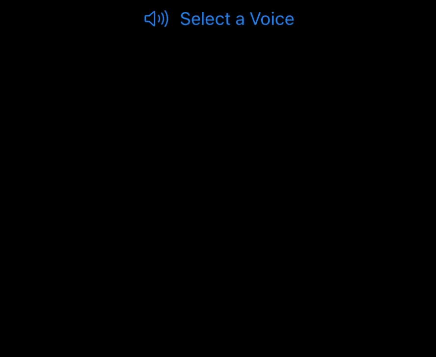

# Create a Voice Changing Video Call App with SwiftUI 

Creating a video call app with Agora is super straightforward, but what about adding cool features to enhance the overall user experience or adding monetisation options? That's where Agora's [Extensions Marketplace](https://console.agora.io/marketplace) comes in.

The Extensions Marketplace launched last month, and already several extensions are available, with more to come.

In this post, we'll show you how to easily add a voice changer to your existing video call app and choose between the available voice options. Thanks to the [Voicemod Voice Changer](https://console.agora.io/marketplace/extension/introduce?serviceName=voicemod), in just three easy steps you will be able to modify your voice with this extension:

1. Enable the extension
2. Pass extension credentials
3. Choose the voice

Now, let's get started.

## Prerequisites

- [An Agora Developer Account - Sign up here](https://sso.agora.io/en/signup?utm_source=medium&utm_medium=blog&utm_campaign=create-a-voice-changing-video-call-app-with-swiftui)
- Xcode 12.3 or later
- A physical iOS device with iOS 13.0 or later
- A basic understanding of iOS development

## Setup

Let’s start with a new, single-view iOS project. Create the project in Xcode, choosing SwiftUI for the interface, and then add the [Agora UIKit](https://github.com/AgoraIO-Community/iOS-UIKit) package.

Add the package by selecting `File > Swift Packages > Add Package Dependency`, and then paste the link into this Swift package:

[`https://github.com/AgoraIO-Community/iOS-UIKit.git`](https://github.com/AgoraIO-Community/iOS-UIKit.git)

When asked for the version, insert `4.0.0-preview`, and select "Up to Next Major". This should install at least version `4.0.0-preview.8`, which is released at the time of writing.

When in doubt, you can always select "Exact" and insert `4.0.0-preview.8`.

---

Once that package installed, the camera and microphone usage descriptions need to be added. To see how to do that, check out Apple's documentation here:

https://developer.apple.com/documentation/avfoundation/cameras_and_media_capture/requesting_authorization_for_media_capture_on_ios#2962313

## Video Call UI

I won't go into much detail about the UI here, because we're mainly focusing on the Voicemod extension, but on a high level:

- The ContentView contains two views: a VideoCallView (defined in the project, and a button to join the channel.
- ContentView holds the active AgoraViewer, which is brought in from Agora UIKit.
- When the button is pressed, the Agora UIKit method join(channel:,with:,as:) is called, which joins the Agora video channel.

This is what the ContentView looks like:

https://gist.github.com/maxxfrazer/c75260a88b065889d8fab53b0b321427?file=Agora-Voicemod-ContentView.swift

And the VideoCallView, without any of the voicemod additions looks like this:

```swift
struct VideoCallView: View {
    @Binding var joinedChannel: Bool
    var body: some View {
        ZStack {
            ContentView.agview
        }
    }
}
```

---

We now have a working video call app with SwiftUI and Agora UIKit. The next step is to integrate the Voicemod extension!

## Integrating Voicemod

### Voicemod Credentials

If you have an account with Agora and are currently signed in, follow [this link](https://console.agora.io/marketplace/extension/introduce?serviceName=voicemod) to activate the Voicemod extension for your account.

First, you will need to activate Voicemod for your account by clicking "Activate" here:


Next, enable Voicemod for the project, the same project as for the Agora App ID used in the app:


Once that's done, you can grab your Voicemod `API Key` and `API Secret` by clicking “view” below the credentials tab:


### Add to Xcode

We need to add the Voicemod extension, which can also be installed via the Swift Package Manager with the following URL:

[`https://github.com/AgoraIO-Community/Extension-Voicemod-iOS.git`](https://github.com/AgoraIO-Community/Extension-Voicemod-iOS.git)

> The latest release at the time of writing is `0.1.2`.

This package doesn't need importing into your Swift code. It just needs to be bundled alongside the Agora SDK in your app target.

### Enable the Extension

When using Agora extensions, you need to enable them before joining a channel.

To do this with Agora UIKit, you can call `AgoraVideoViewer.enableExtension()`.

This method needs to be passed the vendor ("Voicemod"), the vendor extension ("VoicemodExtension") in this case:

```swift
ContentView.agview.viewer.enableExtension(
  withVendor: "Voicemod", extension: "VoicemodExtension", enabled: true
)
```

The above code snippet was added to the beginning of the `joinChannel` method defined earlier.

### Choose the Voice

After joining the channel, we'll add a small menu to the top of our view. This menu will contain all the available voices from Voicemod. On selecting the voice, we'll call a method to make sure we're using that voice. On selecting an option, we update a state variable, `selection`.

The menu is created like this:

https://gist.github.com/maxxfrazer/c75260a88b065889d8fab53b0b321427?file=Agora-Voicemod-Menu.swift

The names array is defined like this:

```swift
let names = [
    "baby",
    "cave",
    "lost-soul",
    "robot",
    "titan"
]
```

This is what the menu looks like:



---

Almost there now! The only thing left to do is define the setVoicemodParam method.

This method needs to do two things:

1. Initialise Voicemod, passing the API Key and API Secret values.
2. Set the voice property so that it knows which voice effect you want to have.

First, let's define a function `registerVoicemod` for setting the key and secret:

```swift
func registerVoicemod() {
  // Set API Credentials
  let dataDict = [
    "apiKey": AppKeys.voicemodApiKey,
    "apiSecret": AppKeys.voicemodApiSecret
  ]
  guard let setPropertyResp = ContentView.agview.viewer.setExtensionProperty(
    "Voicemod", extension: "VoicemodExtension",
    key: "vcmd_user_data", codable: dataDict
  ), setPropertyResp == 0 else {
    print("Could not set extension property")
    return
  }

  self.voicemodRegistered = true
}
```

Here we are using the method `setExtensionProperty` with the `vcmd_user_data` key. The API Key and API Secret properties are stored in a Swift dictionary of type `[String: String]`. This method from Agora UIKit allows us to pass a Swift dictionary, which is then encoded for us and passed to Agora's engine.

If something goes wrong, either `setPropertyResp` will be null or the response will be less than zero. But if all the steps are followed, no issues should arise!

Now the method `setVoicemodParam` can be defined. This method must call `registerVoicemod` (first time only), and then set the voice value (robot, baby etc.):

```swift
func setVoicemodParam(to voiceName: String) {
  if !self.voicemodRegistered {
    self.registerVoicemod()
  }

  // SET VOICE
  ContentView.agview.viewer.setExtensionProperty(
    "Voicemod", extension: "VoicemodExtension",
    key: "vcmd_voice", strValue: voiceName
  )
}

```

## Conclusion

You now have a video call app complete with the new extension from Voicemod!

There are other extensions I'd encourage you to try out, and they can all be found here:

https://console.agora.io/marketplace

The same settings can be applied to an application made directly with the Agora SDK, but you will need to make sure you're using the 4.x version of the SDK. Details can be found here:

https://docs.agora.io/en/video-call-4.x-preview/landing-page?platform=iOS

The methods, such as `setExtensionProperty`, used in this post are adaptations of the SDK's built-in methods relating to extension. They can be found in this file from Agora Video UIKit:

https://github.com/AgoraIO-Community/iOS-UIKit/blob/4.0.0-preview.8/Sources/Agora-UIKit/AgoraVideoViewer%2BAgoraExtensions.swift

## Testing

You can try out this app by following the GitHub link:

https://github.com/AgoraIO-Community/Extension-Voicemod-SwiftUI

## Other Resources

For more information about building applications using Agora SDKs, take a look at the [Agora Video Call Quickstart Guide](https://docs.agora.io/en/Video/start_call_ios?platform=iOS&utm_source=medium&utm_medium=blog&utm_campaign=extension-voicemod-swiftui) and [Agora API Reference](https://docs.agora.io/en/Video/API%20Reference/oc/docs/headers/Agora-Objective-C-API-Overview.html?utm_source=medium&utm_medium=blog&utm_campaign=extension-voicemod-swiftui).

I also invite you to [join the Agora Developer Slack community](https://www.agora.io/en/join-slack/) to meet with our developer team as well as other like-minded developers and technical enthusiasts.

